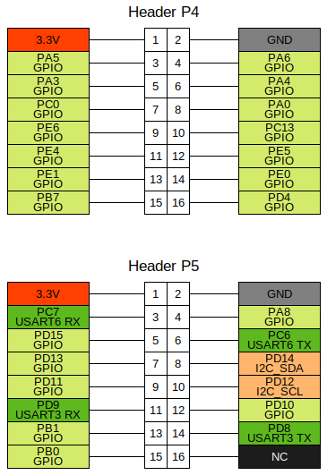
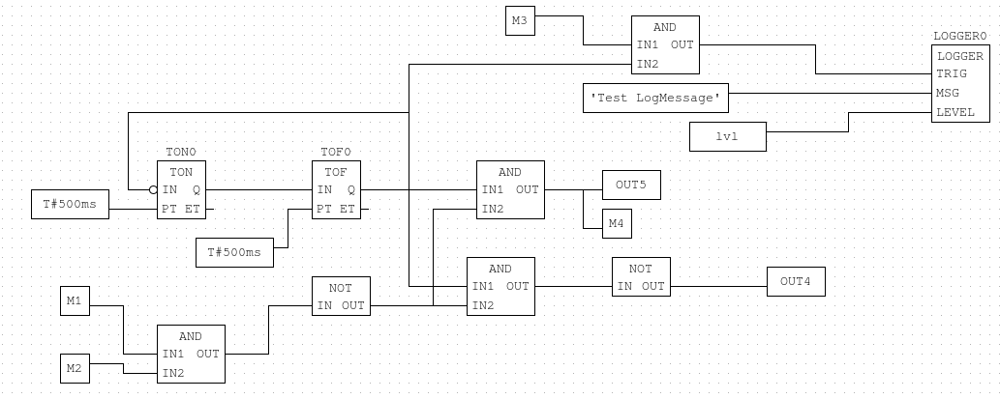

## Note:

The code is very much a work in progress and likely contains bugs. Consider it to be pre-alpha quality.

This code is an attempt to explore a solution; hence, it may contain errors. Users should be aware that significant work is needed to refine it.

## Project:

This project provides a runtime environment to execute PLC programs created with the Beremiz IDE on an STM32F4 with the Zephyr RTOS. The extension of the Beremiz IDE is achieved through a new target without modifications to the IDE itself. A publication on Git is forthcoming; however, the code requires some revisions.

The current target platform is a board named "Industrial Control Stm32f407VET6 Development Board," sold under the name JZ-F407VET6, featuring an STM32F407VET6 with 512 kB Flash and 128+64 kB RAM. Another board with an STM32F4 processor and Flash/RAM >= as mentioned above should also work, along with a W5500 for network connectivity. However, this has not been tested and likely requires adjustments to the devicetree and board.

## Setup:

1. Follow the Zephyr Getting Started Guide [here](https://docs.zephyrproject.org/3.6.0/develop/getting_started/index.html) for installing Zephyr and the toolchain.

   For Ubuntu users, here's a possible approach:

   - Download and install the toolchain `zephyr-sdk-0.16.5_linux-x86_64_minimal` using the following commands:
     ```
     cd ~
     wget https://github.com/zephyrproject-rtos/sdk-ng/releases/download/v0.16.5/zephyr-sdk-0.16.5_linux-x86_64_minimal.tar.xz
     ./setup.sh -t arm-zephyr-eabi -h -c
     ```

   - Initialize the Zephyr workspace:
     ```
     west init -m https://github.com/nandibrenna/Beremiz4uC workspace
     cd workspace
     west update
     pip3 install -r zephyr/scripts/requirements.txt
     west zephyr-export
     ```

   To connect with the Beremiz IDE, `erpc` (https://github.com/EmbeddedRPC/erpc) is used. When building `Beremiz4uC`, CMake also generates the shim code for this connection. Ensure `erpcgen` versions on PC/Beremiz IDE and STM32 match.

   - Download `erpcgen` from [here](https://github.com/EmbeddedRPC/erpc/releases) and install it. See [here](https://github.com/EmbeddedRPC/erpc/wiki/erpcgen) for details.

   - For Ubuntu, you might install `erpcgen` in `/usr/local/bin`.

2. Start the build in the `workspace` directory:
   ```	
	west build -p always -b PLC_STM32F407VE beremiz4uc/app
   ```

3. Flash the app to the board:
   ```
   west flash
   ```

4. USART6 is configured for shell access in the file `beremiz4uc/boards/arm/PLC_STM32F407VE/PLC_STM32F407VE.dts`.
   

5. In the `prj.conf` file, choose between GPIO control via I2C (`CONFIG_IO_TEST_I2C_GPIO=y`) or STM32 GPIO (`CONFIG_IO_TEST_STM32_GPIO=y`). Currently, only 2 outputs are available for STM32 GPIO.

6. In the `test` directory, there's a `plc.bin` containing a small PLC program that alternates blinking two outputs. It was gradually developed for testing purposes and is accordingly poorly structured and unclear.

To use it, you'll need to use an SD card. Start the STM32 with an empty SD card formatted in FAT32 to create the necessary directories. Place `plc.bin` in the `plc` directory.

7. Various tests can be conducted via the shell. Type `help` or `plc help` in the shell to display available commands.

IDE extension is forthcoming once the code is cleaned up appropriately.
